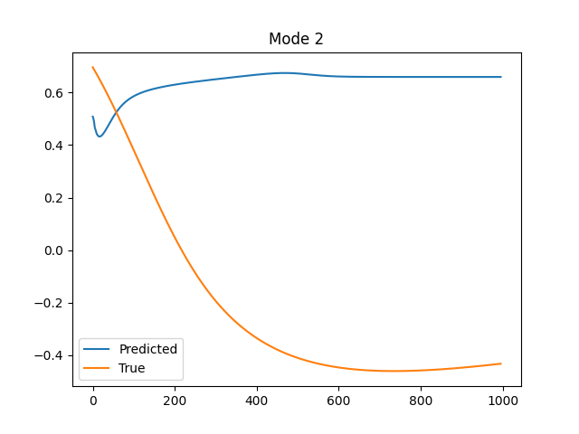
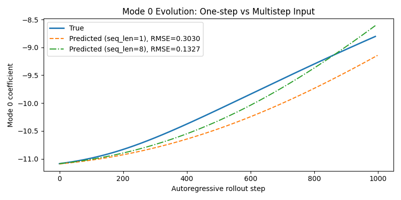
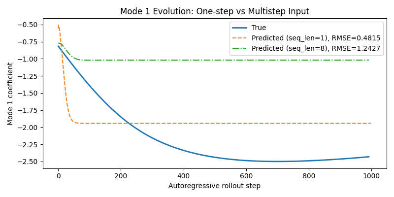
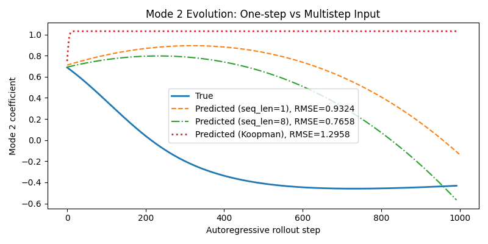
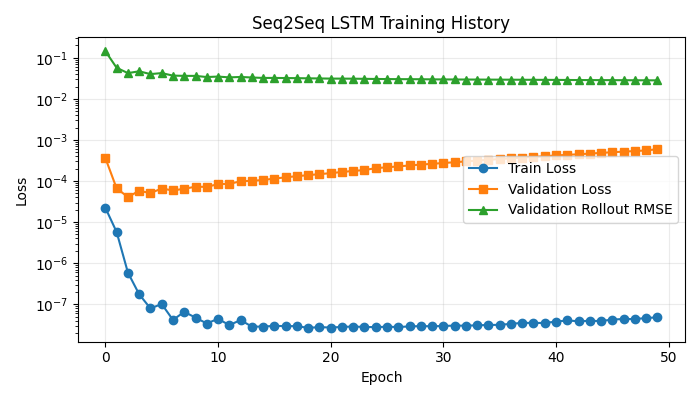
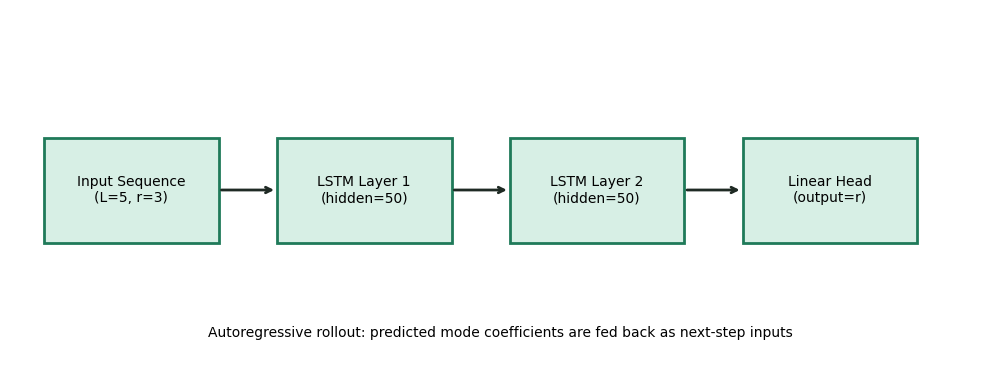

# CBurgers_Codex

This mini-application demonstrates a C++ and Python scientific machine learning workflow:

1. C++ solves a 1D viscous Burgers equation and streams snapshots in situ.
2. Python performs SVD-based modal compression.
3. Two PyTorch LSTM variants are trained on modal coefficients and deployed autoregressively:
   - one-step input model (`seq_len=1`)
   - multistep input model (`seq_len=8`)
4. Result figures are generated directly from the workflow.

For project context, see the original paper link in the repo history: [10.1063/5.0019884](https://doi.org/10.1063/5.0019884).

## Session Deliverables

- Browser-renderable dashboard: [`docs/dashboard.html`](docs/dashboard.html)
- Browser-renderable report (PDF): [`docs/changes_summary.pdf`](docs/changes_summary.pdf)
- GitHub Pages entry point (after enabling Pages): `https://isclpurdue.github.io/CBurgers_Codex/`

## Current Build and Run Instructions

These steps match the current source code and dependency setup.

### 1. Create and activate a Python environment

```bash
python3 -m venv .venv
source .venv/bin/activate
```

### 2. Install Python dependencies

```bash
pip install numpy scipy matplotlib jupyter cmake torch scikit-learn
```

### 3. Configure and build C++

```bash
.venv/bin/cmake -S . -B build_local -DPython3_EXECUTABLE=.venv/bin/python
.venv/bin/cmake --build build_local -j
```

### 4. Run from `build/` so Python modules are found

The runtime imports `python_module.py` from the current working directory (`build/`), and embedded Python needs access to venv packages.

```bash
cd build
PYTHONPATH="$(../.venv/bin/python -c 'import site; print(site.getsitepackages()[0])')" \
MPLCONFIGDIR=../.mplconfig \
../build_local/app
```

## Output Artifacts (Current Paths)

Generated outputs are in `build/`:

- `build/Field_evolution.png`
- `build/SVD_Eigenvectors.png`
- `build/Mode_0_prediction.png`
- `build/Mode_1_prediction.png`
- `build/Mode_2_prediction.png`
- `build/Mode_0_comparison.png`
- `build/Mode_1_comparison.png`
- `build/Mode_2_comparison.png`
- `build/Mode_0_prediction_onestep.png`
- `build/Mode_1_prediction_onestep.png`
- `build/Mode_2_prediction_onestep.png`
- `build/Mode_0_prediction_multistep.png`
- `build/Mode_1_prediction_multistep.png`
- `build/Mode_2_prediction_multistep.png`
- `build/Training_Loss.png`
- `build/Training_Loss_onestep.png`
- `build/Training_Loss_multistep.png`
- `build/Torch_LSTM_Schematic.png`
- `build/Torch_LSTM_Schematic_onestep.png`
- `build/Torch_LSTM_Schematic_multistep.png`
- `build/eigenvectors.npy`
- `build/checkpoints/my_checkpoint_onestep.pt`
- `build/checkpoints/my_checkpoint_multistep.pt`

## Result Preview

### Field evolution


### Modal decomposition


### Forecasting modal evolution




### One-step vs multistep input comparison (autoregressive rollout)




Latest rollout RMSE per mode:
- one-step input (`seq_len=1`): `[1.2709553, 0.4815025, 1.2855033]`
- multistep input (`seq_len=8`): `[1.2374445, 1.242674, 0.9698531]`

### Training loss history (PyTorch LSTM)


### Torch LSTM architecture schematic

